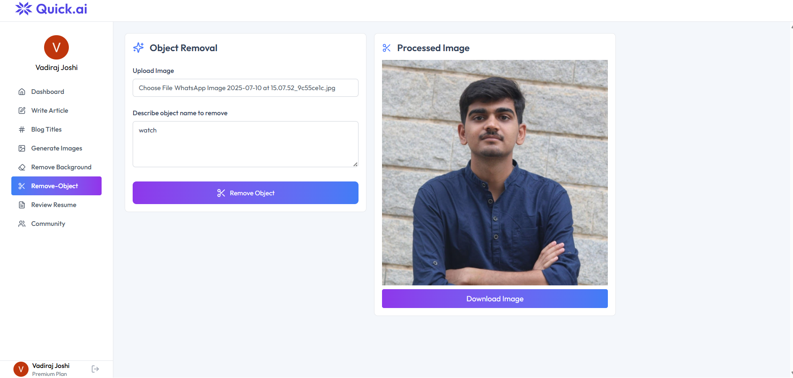

# 🚀 Quick AI - Your All-in-One AI Assistant

<div align="center">


**A powerful AI-powered platform that brings multiple AI tools under one roof**

[](https://quick-ai-gray.vercel.app/)
[](https://reactjs.org/)
[](https://nodejs.org/)
[](https://openai.com/)
[](https://clerk.com/)

[🌐 **Try it Live**](https://quick-ai-gray.vercel.app/) | [📖 Documentation](#table-of-contents) | [🚀 Quick Start](./QUICK_START.md)

</div>

---

## 📋 Table of Contents

- [About](#about)
- [Live Demo](#live-demo)
- [Features](#features)
- [Screenshots](#screenshots)
- [Tech Stack](#tech-stack)
- [Prerequisites](#prerequisites)
- [Installation](#installation)
- [Environment Variables](#environment-variables)
- [Running the Application](#running-the-application)
- [Deployment](#deployment)
- [Project Structure](#project-structure)
- [Contributing](#contributing)
- [License](#license)

---

## 🎯 About

**Quick AI** is a comprehensive AI-powered platform that provides multiple AI tools in a single, intuitive interface. From content creation to image manipulation, Quick AI leverages cutting-edge AI technologies to help users accomplish various tasks efficiently.

### 🌐 Live Demo

**Experience Quick AI now:** [https://quick-ai-gray.vercel.app/](https://quick-ai-gray.vercel.app/)

No installation required - try all features directly in your browser!

---

## ✨ Features

### 📝 Content Generation
- **Write Article** - Generate full-length articles on any topic with AI assistance
- **Blog Titles** - Create catchy and SEO-friendly blog titles instantly

### 🎨 Image Tools
- **Generate Images** - Create stunning AI-generated images from text descriptions
- **Remove Background** - Automatically remove backgrounds from images
- **Remove Object** - Intelligently remove unwanted objects from photos

### 📄 Document Analysis
- **Review Resume** - Get AI-powered feedback and suggestions for your resume

### 👥 Community
- **Community Hub** - Share and explore AI-generated content with other users

---

## 📸 Screenshots

### Home Page

*Modern and intuitive landing page showcasing all AI tools*

### Dashboard


*Clean dashboard interface with easy access to all features*

### Article Writer

*AI-powered article generation with real-time preview*

### Image Generation

*Create stunning images from text descriptions*

### Background Removal

*One-click background removal with AI precision*

### Object Removal

*Remove unwanted objects from photos with AI precision*

### Resume Review

*Get detailed AI feedback on your resume*

---

## 🛠️ Tech Stack

### Frontend
- **React 19.1.0** - Modern UI library
- **Vite** - Lightning-fast build tool
- **TailwindCSS 4.1.11** - Utility-first CSS framework
- **React Router DOM** - Client-side routing
- **Clerk** - Authentication and user management
- **Axios** - HTTP client
- **Lucide React** - Beautiful icon library
- **React Markdown** - Markdown rendering
- **React Hot Toast** - Toast notifications

### Backend
- **Node.js** - JavaScript runtime
- **Express 5.1.0** - Web application framework
- **OpenAI API** - AI model integration
- **Clerk Express** - Backend authentication
- **Cloudinary** - Image storage and manipulation
- **Neon Database** - Serverless PostgreSQL
- **Multer** - File upload handling
- **PDF Parse** - PDF document processing

---

## 📦 Prerequisites

Before you begin, ensure you have the following installed:

- **Node.js** (v18 or higher) - [Download](https://nodejs.org/)
- **npm** or **yarn** - Package manager
- **Git** - Version control

You'll also need accounts and API keys for:
- [Clerk](https://clerk.com/) - For authentication
- [OpenAI](https://platform.openai.com/) - For AI features
- [Cloudinary](https://cloudinary.com/) - For image storage
- [Neon](https://neon.tech/) - For database

---

## 🚀 Installation

### 1. Clone the Repository

```bash
git clone https://github.com/yourusername/quick-ai.git
cd quick-ai
```

### 2. Install Server Dependencies

```bash
cd server
npm install
```

### 3. Install Client Dependencies

```bash
cd ../client
npm install
```

---

## 🔐 Environment Variables

### Server Environment Variables

Create a `.env` file in the `server` directory:

```env
# Server Configuration
PORT=3000

# Clerk Authentication
CLERK_PUBLISHABLE_KEY=your_clerk_publishable_key
CLERK_SECRET_KEY=your_clerk_secret_key

# OpenAI Configuration
OPENAI_API_KEY=your_openai_api_key

# Cloudinary Configuration
CLOUDINARY_CLOUD_NAME=your_cloud_name
CLOUDINARY_API_KEY=your_cloudinary_api_key
CLOUDINARY_API_SECRET=your_cloudinary_api_secret

# Neon Database
DATABASE_URL=your_neon_database_url
```

### Client Environment Variables

Create a `.env` file in the `client` directory:

```env
# Clerk Configuration
VITE_CLERK_PUBLISHABLE_KEY=your_clerk_publishable_key

# API URL
VITE_API_URL=http://localhost:3000
```

---

## ▶️ Running the Application

### Development Mode

#### 1. Start the Backend Server

Open a terminal and run:

```bash
cd server
npm run server
```

The server will start on `http://localhost:3000`

#### 2. Start the Frontend Development Server

Open another terminal and run:

```bash
cd client
npm run dev
```

The client will start on `http://localhost:5173`

### Production Mode

#### Build the Client

```bash
cd client
npm run build
```

#### Start the Production Server

```bash
cd server
npm start
```

---


### Environment Variables for Production

Make sure to set all required environment variables in your deployment platform:

**Frontend:**
- `VITE_CLERK_PUBLISHABLE_KEY`
- `VITE_API_URL`

**Backend:**
- `PORT`
- `CLERK_PUBLISHABLE_KEY`
- `CLERK_SECRET_KEY`
- `OPENAI_API_KEY`
- `CLOUDINARY_CLOUD_NAME`
- `CLOUDINARY_API_KEY`
- `CLOUDINARY_API_SECRET`
- `DATABASE_URL`

---

## 📁 Project Structure

```
quick-ai/
├── client/                 # Frontend React application
│   ├── public/            # Static assets
│   ├── src/
│   │   ├── components/    # Reusable UI components
│   │   │   ├── AiTools.jsx
│   │   │   ├── CreationItem.jsx
│   │   │   ├── Footer.jsx
│   │   │   ├── Hero.jsx
│   │   │   ├── Navbar.jsx
│   │   │   ├── Plan.jsx
│   │   │   ├── Sidebar.jsx
│   │   │   └── Testimonials.jsx
│   │   ├── pages/         # Page components
│   │   │   ├── BlogTitles.jsx
│   │   │   ├── Community.jsx
│   │   │   ├── Dashboard.jsx
│   │   │   ├── GenerateImages.jsx
│   │   │   ├── Home.jsx
│   │   │   ├── Layout.jsx
│   │   │   ├── RemoveBackground.jsx
│   │   │   ├── RemoveObject.jsx
│   │   │   ├── ReviewResume.jsx
│   │   │   └── WriteArticle.jsx
│   │   ├── App.jsx        # Main app component
│   │   └── main.jsx       # Entry point
│   ├── package.json
│   └── vite.config.js
│
├── server/                # Backend Express application
│   ├── configs/          # Configuration files
│   ├── controllers/      # Route controllers
│   ├── middlewares/      # Custom middlewares
│   ├── routes/           # API routes
│   │   ├── aiRoutes.js
│   │   └── userRoutes.js
│   ├── server.js         # Server entry point
│   └── package.json
│
└── README.md             # Project documentation
```

---

## 🎨 Features in Detail

### 1. Article Writer
Generate comprehensive articles on any topic. Simply provide a topic or keywords, and the AI will create well-structured, engaging content.

### 2. Blog Title Generator
Struggling with blog titles? Get multiple creative and SEO-optimized title suggestions instantly.

### 3. AI Image Generation
Transform your ideas into stunning visuals. Describe what you want, and watch as AI brings your imagination to life.

### 4. Background Removal
Professional background removal in seconds. Perfect for product photos, profile pictures, and more.

### 5. Object Removal
Remove unwanted objects or people from your photos seamlessly with AI-powered inpainting.

### 6. Resume Review
Upload your resume and receive detailed feedback on formatting, content, keywords, and suggestions for improvement.

---


## 🤝 Contributing

Contributions are welcome! Please follow these steps:

1. Fork the repository
2. Create a new branch (`git checkout -b feature/amazing-feature`)
3. Commit your changes (`git commit -m 'Add some amazing feature'`)
4. Push to the branch (`git push origin feature/amazing-feature`)
5. Open a Pull Request

---

## 📄 License

This project is licensed under the ISC License.

---

## 👨‍💻 Author

**Your Name**
- GitHub: (https://github.com/vadiraj-22)
- LinkedIn: (https://linkedin.com/in/vadiraj-joshi220504)

---

## 🙏 Acknowledgments

- [OpenAI](https://openai.com/) for providing powerful AI models
- [Clerk](https://clerk.com/) for seamless authentication
- [Cloudinary](https://cloudinary.com/) for image management
- [Neon](https://neon.tech/) for serverless PostgreSQL
- All contributors and users of Quick AI

---

<div align="center">

**Made with ❤️ and AI**

⭐ Star this repo if you find it helpful!

</div>
